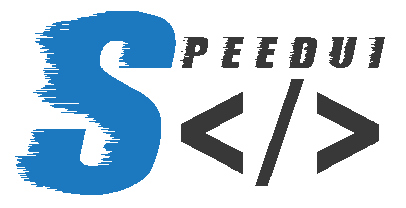

# Speedui

**Attention** : En cours de création

> Speedui est une série de balises HTML ou de composants permettant de rapidement prototyper une Web App, soit en important le module via nodeJS dans une application codée en typescript, soit en utilisant ces balises dans l'index.html fourni dans le zip à télécharger.
